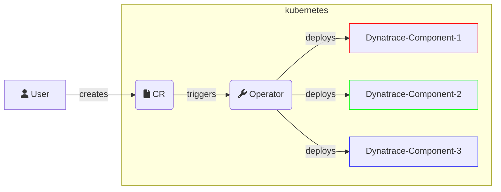

# Architecture

This document describes the high-level architecture of `Dynatrace Operator`.
If you want to familiarize yourself with the code base, you are just in the right place!

## Bird's Eye View

On a very high level, what the operator does is for a given `CustomResource`(CR) provided by the user, the `Operator` will deploy _one or several_ Dynatrace components into the Kubernetes Environment.

A bit more specifically:

- A `CustomResource`(CR) is configured by the user, where they provide what features or components they want to use, and provide some minimal configuration in the CR so the `Dynatrace Operator` knows what to deploy and how to configure it.
- The `Operator` not only deploys the different Dynatrace components, but also keeps them up to date.
  - The `CustomResource`(CR) defines a state, the `Dynatrace Operator` enforces it, makes it happen.

### Dynatrace Operator components

The `Dynatrace Operator` is not a single Pod, it consists of multiple components, encompassing several Kubernetes concepts.

#### Operator

This component/pod is the one that _reacts to_ the creation/update/delete of our`CustomResource(s)`, causing the `Operator` to _reconcile_.
A _reconcile_ just means that it will check what is in the `CustomResource(s)` and according to that creates/updates/deletes resources in the Kubernetes environment. (So the state of the Kubernetes Environment matches the state described in the `CR`)

Relevant links:

- [Operator Pattern](https://kubernetes.io/docs/concepts/extend-kubernetes/operator/)

#### Webhook

This component/pod is the one that _intercepts_ creation/update/delete of Kubernetes Resources (only those that are relevant), then either mutates or validates them.

- Validation: We only use it for our `CustomResource(s)`, it's meant to catch known misconfigurations. If the validation webhook detects a problem, the user is warned, the change is denied and rolled back, like nothing happened.
- Mutation: Used to modify Kubernetes Resources "in flight", so the Resource will be created/updated in the cluster like if it was applied with added modifications.
  - We have 2 use-cases for this:
    - Seamlessly modifying user resources with the necessary configuration needed for Dynatrace observability features to work.
    - Handle time/timing sensitive minor modifications (labeling, annotating) of user resources, which is meant to help the `Operator` perform more reliably and timely.

Relevant links:

- [What are webhooks?](https://kubernetes.io/docs/reference/access-authn-authz/extensible-admission-controllers/#what-are-admission-webhooks)

#### Init Container

Some configurations need to happen on the container filesystem level, like setting up a volume or creating/updating configuration files.
To achieve this we add our init-container (using the `Webhook`) to user Pods. As init-containers run before any other container, we can setup the environment of user containers to enable Dynatrace observability features.

Relevant links:

- [Init Containers](https://kubernetes.io/docs/concepts/workloads/pods/init-containers/)

#### CSI-Driver

A component that is present on all nodes, meant to provide volumes (based on the node's filesystem) to make the capabilities provided by the `Operator` to use less disk space and be more performant.

Relevant links:

- [CSI volume](https://kubernetes.io/docs/concepts/storage/volumes/#csi)

## Code Map

> TODO: Improve folder structure before documenting it more deeply, as its kind of a mess now. If I didn't mention it now, then I probably don't like its current location.

### `config`

Contains the `.yaml` files that are need to deploy the `Operator` and it`s components into a Kubernetes cluster.

- most `.yaml` files are part of the Helm chart
- other `.yaml` files are relevant for different marketplaces

### `hack`

Collection of scripts used for:

- CI tasks
- Development (build,push,deploy,test, etc...)

### `hack/make`

Where the `make` targets are defined. We don't have a single makefile with all the targets as it would be quite large.

### `test`

E2E testing code. Unit tests are NOT found here, they are in the same module that they are testing, as that is the Golang convention.

### `cmd`

Where the entry points for every `Operator` subcommand is found. The `Operator` is not a single container, but we still use the same image for all our containers, to simplify the caching for Kubernetes and mirroring of the `Operator` image in private registries. So each component has its own subcommand.

### `pkg/api`

Contains the `CustomResourceDefinitions`(CRDs) as Golang `structs` that the `Operator` reacts to. The `CustomResourceDefinition` yaml files are generated based on these `structs`.

### `pkg/controllers`

A Controller is a component that listens/reacts to some Kubernetes Resource. The `Operator` has several of these.

### `pkg/controllers/certificates`

The `Operator` creates and maintains certificates that are meant to be used by the webhooks. Certificates are required for a webhook to work in kubernetes, and hard coding certificates into the release of the `Operator` is not an option, the same is true for requiring the user to setup `cert-manager` to create/manage certs for the webhooks.

### `pkg/controllers/csi/driver`

Main logic for the CSI-Driver's `server` container. Implements the CSI gRPC interface, and handles each mount request.

### `pkg/controllers/csi/provisioner`

Main logic for the CSI-Driver's `provisioner` container. Handles the setting up the environment(filesystem) on the node, so the `server` container can complete its task quickly without making any external requests.

### `pkg/controllers/dynakube` and `src/controllers/edgeconnect`

Main logic for the 2 `CustomResources`es the `Operator` currently has.

### `pkg/controllers/node`

The `Operator` keeps track of the nodes in the Kubernetes cluster, this is necessary to notice intentional node shutdowns so the `Operator` can notify the `Dynatrace Environment` about it. Otherwise the `Dynatrace Environment` would produce warnings when a node is shutdown even when it was intentional.

### `pkg/webhook/mutation`

Mutation webhooks meant for intercepting user Kubernetes Resources, so they can be updated in the instant the updates are required.

### `pkg/webhook/validation`

Validation webhooks meant for intercepting our `CustomResources` managed by the users, is they can be checked for well-know misconfigurations and warn the user if any problems found.

### `pkg/injection/startup`

Main logic for the init-container injected by the `Operator`.
