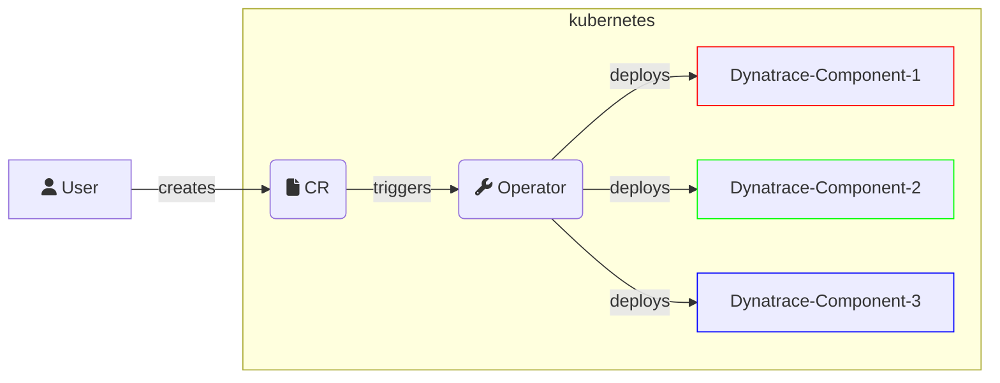

# Architecture

This document describes the high-level architecture of `Dynatrace Operator`.
If you want to familiarize yourself with the code base, you are just in the right place!

## Bird's Eye View



On a very high level, what the operator does is for a given `CustomResource`(CR) provided by the user, the `Operator` will deploy _one or several_ Dynatrace components into the Kubernetes Environment.

A bit more specifically:

- A `CustomResource`(CR) is configured by the user, where they provide what features or components they want to use, and provide some minimal configuration in the CR so the `Dynatrace Operator` knows what to deploy and how to configure it.
- The `Operator` not only deploys the different Dynatrace components, but also keeps them up to date.
  - The `CustomResource`(CR) defines a state, the `Dynatrace Operator` enforces it, makes it happen.

## Custom Resources

The Dynatrace Operator supports two main Custom Resource Definitions (CRDs):

### DynaKube

The primary CRD for deploying and managing Dynatrace observability components. The latest API version is stored in `pkg/api/latest/dynakube/`, with versioned APIs maintained for backward compatibility (v1beta3, v1beta4, v1beta5).

**Key Features:**

- **OneAgent Modes:**
  - `classicFullStack`: Pod per node for full-stack monitoring
  - `applicationMonitoring`: Webhook-based app-only injection with optional CSI driver caching
  - `hostMonitoring`: Node-only monitoring using CSI driver for read-only operation
  - `cloudNativeFullStack`: Combined application and host monitoring
- **ActiveGate Capabilities:**
  - `routing`: Routes OneAgent traffic through ActiveGate
  - `kubernetes-monitoring`: Monitors Kubernetes API
  - `metrics-ingest`: Routes enriched metrics through ActiveGate
- **Additional Features:**
  - Extension monitoring
  - Log monitoring
  - OpenTelemetry Collector integration
  - KSPM (Kubernetes Security Posture Management)
  - Metadata enrichment

### EdgeConnect

Manages Dynatrace EdgeConnect deployments for extending observability to remote locations. The latest API version is `v1alpha2` in `pkg/api/v1alpha2/edgeconnect/`.

## Dynatrace Operator Components

The `Dynatrace Operator` is not a single Pod—it consists of multiple components working together, encompassing several Kubernetes concepts.

### Main Operator Pod

The central controller (`cmd/operator/`) that reconciles Custom Resources. It consists of multiple sub-reconcilers:

**DynaKube Controller** (`pkg/controllers/dynakube/`):

Handles DynaKube CR reconciliation with feature-specific sub-reconcilers:

- `activegate`: Manages ActiveGate StatefulSets
- `oneagent`: Handles OneAgent DaemonSets for host monitoring
- `injection`: Manages code module / otlp injection into application pods
- `extension`: Controls Dynatrace extensions deployment
- `otelc`: Manages OpenTelemetry Collector deployment
- `logmonitoring`: Handles log monitoring components
- `kspm`: Manages Kubernetes Security Posture Management
- `apimonitoring`: Monitors Kubernetes API
- `istio`: Handles Istio service mesh integration
- `proxy`: Manages proxy configurations
- `deploymentmetadata`: Manages deployment metadata enrichment

**EdgeConnect Controller** (`pkg/controllers/edgeconnect/`):

- Manages EdgeConnect deployments for remote observability

**Node Controller** (`pkg/controllers/nodes/`):

- Monitors node lifecycle and maintains node-level state

**Certificates Controller** (`pkg/controllers/certificates/`):

- Manages TLS certificates for secure communication

The operator uses a reconciliation loop pattern with smart update intervals (1m for fast changes, 5m for detected changes, 30m default) to efficiently manage resources while minimizing API calls.

Relevant links:

- [Operator Pattern](https://kubernetes.io/docs/concepts/extend-kubernetes/operator/)

### Webhook Pod

The webhook server (`cmd/webhook/`) intercepts creation/update/delete of Kubernetes Resources and either mutates or validates them.

**Validation Webhooks** (`pkg/webhook/validation/`):

- Validates DynaKube and EdgeConnect CRs to catch misconfigurations before they're applied
- Prevents invalid changes from reaching the cluster

**Mutation Webhooks** (`pkg/webhook/mutation/`):

- **Pod Mutation** (`mutation/pod/`): Injects init containers, volumes, environment variables, and annotations into user pods for application monitoring
- **Namespace Mutation** (`mutation/namespace/`): Labels and annotates namespaces to track injection status and configuration

The webhook uses TLS 1.3 for secure communication and includes health/readiness probes for reliability.

Relevant links:

- [What are webhooks?](https://kubernetes.io/docs/reference/access-authn-authz/extensible-admission-controllers/#what-are-admission-webhooks)

### Bootstrapper (Init Container)

The bootstrapper (`cmd/bootstrapper/`) runs as an init container injected into user pods via the webhook. It:

- Downloads OneAgent code modules from Dynatrace or CSI volumes
- Configures the OneAgent for the specific application
- Sets up metadata enrichment
- Prepares the filesystem for application monitoring

It can operate in two modes:

1. CSI-backed: Uses pre-downloaded code modules from the CSI driver
2. Direct download: Fetches code modules directly from Dynatrace API

Relevant links:

- [Init Containers](https://kubernetes.io/docs/concepts/workloads/pods/init-containers/)

### CSI Driver

A Container Storage Interface driver (`cmd/csi/`) that provides volumes for OneAgent code modules. It consists of multiple components:

**CSI Server** (`csi/server/`):

- Main CSI driver implementation running on each node
- Handles volume provisioning and mounting

**CSI Provisioner** (`csi/provisioner/`):

- Manages volume lifecycle and provisioning

**Node Driver Registrar** (`csi/registrar/`):

- Registers the CSI driver with the Kubelet

**CSI Init** (`csi/init/`):

- Initializes the CSI driver environment

**Liveness Probe** (`csi/livenessprobe/`):

- Monitors CSI driver health

The CSI driver optimizes disk space usage by sharing OneAgent binaries across multiple pods on the same node and improves startup performance by caching downloads.

Relevant links:

- [CSI volume](https://kubernetes.io/docs/concepts/storage/volumes/#csi)

### Metadata Enrichment Service

A utility service (`cmd/metadata/`) that generates metadata files containing Kubernetes attributes (namespace, pod name, labels, etc.) for enriching telemetry data sent to Dynatrace.

### Support Tools

**Support Archive** (`cmd/supportarchive/`):

- Collects diagnostic information from the cluster
- Gathers operator logs, DynaKube/EdgeConnect status, and resource states
- Helps troubleshoot issues with Dynatrace support

**Troubleshoot** (`cmd/troubleshoot/`):

- Command-line tool for diagnosing common deployment issues
- Checks CRDs, namespaces, images, proxies, and configurations
- Outdated, use support archive for comprehensive diagnostics

**Startup Probe** (`cmd/startupprobe/`):

- Validates that OneAgent has started correctly in pods

## Codebase Structure

### Package Organization

The codebase follows a clear separation of concerns:

**`cmd/`** - Entry points for all executables

- Each subdirectory contains a CLI command that can be invoked
- The main binary includes all commands as subcommands via Cobra
- Examples: `operator`, `webhook`, `csi-server`, `bootstrap`, `troubleshoot`

**`pkg/api/`** - Custom Resource Definitions and API types

- `latest/` - Current API version (symlink or main version)
- `v1alpha1/`, `v1alpha2/`, `v1beta3/`, etc. - Versioned APIs
- `conversion/` - API version conversion logic
- `validation/` - CR validation logic
- `scheme/` - Kubernetes scheme registration

**`pkg/controllers/`** - Reconciliation logic

- `dynakube/` - DynaKube controller and sub-reconcilers
- `edgeconnect/` - EdgeConnect controller
- `nodes/` - Node lifecycle controller
- `csi/` - CSI driver implementation
- `certificates/` - Certificate management

**`pkg/webhook/`** - Admission webhook handlers

- `mutation/` - Mutating webhooks for pods and namespaces
- `validation/` - Validating webhooks for CRs

**`pkg/clients/`** - External API clients

- `dynatrace/` - Dynatrace API client
- `edgeconnect/` - EdgeConnect API client

**`pkg/injection/`** - Code module injection logic

- `codemodule/` - Code module installer and management
- `namespace/` - Namespace injection mapper

**`pkg/util/`** - Utility packages

- Common utilities for Kubernetes operations, hashing, tokens, conditions, etc.

**`pkg/otelcgen/`** - OpenTelemetry Collector generation

- Logic for generating OpenTelemetry Collector configurations and components

**`pkg/logd/`** - Logging

- Logging configuration and utilities

**`pkg/oci/`** - OCI Image Handling

- Utilities for interacting with OCI registries and images

**`pkg/arch/`** - Architecture Constants

- CPU architecture specific constants and utilities

### Key Design Patterns

**Builder Pattern**: Used extensively for creating reconcilers and clients, allowing flexible configuration and testability

**Reconciler Pattern**: Each feature has its own reconciler that implements a `Reconcile()` method, composed together in the main controller

**Status Subresource**: CRs maintain a status field tracking deployment state, versions, and conditions

**Watch & Reconcile**: Controllers watch for changes to CRs and owned resources, triggering reconciliation with smart backoff intervals

## Development Workflow

### Binary Modes

The main binary (`cmd/main.go`) is a multi-mode executable that behaves differently based on the subcommand:

```bash
dynatrace-operator operator                  # Run the main operator
dynatrace-operator webhook                   # Run the webhook server
dynatrace-operator csi-server                # Run CSI driver server
dynatrace-operator csi-init                  # Run CSI driver initialization
dynatrace-operator csi-provisioner           # Run CSI driver provisioner
dynatrace-operator csi-node-driver-registrar # Run CSI node driver registrar
dynatrace-operator livenessprobe             # Run CSI liveness probe
dynatrace-operator bootstrap                 # Run bootstrapper (init container)
dynatrace-operator troubleshoot              # Run troubleshooting tool
dynatrace-operator support-archive           # Generate support bundle
dynatrace-operator startup-probe             # Run startup probe
dynatrace-operator generate-metadata         # Generate metadata file
```

This design allows using a single container image with different entry points for different components.

### Reconciliation Flow

1. **Watch**: Controller watches DynaKube/EdgeConnect CRs and owned resources
2. **Queue**: Changes trigger reconcile requests added to a work queue
3. **Reconcile**: Controller processes the request:
   - Fetches the current CR state
   - Calls sub-reconcilers for each feature
   - Updates Kubernetes resources (StatefulSets, DaemonSets, etc.)
   - Updates CR status with results
4. **Requeue**: Returns with a requeue interval (1m/5m/30m based on state)

### Testing Strategy

- **Unit Tests**: Test individual functions and components in isolation
- **Integration Tests**: Test controller behavior with fake Kubernetes clients
- **E2E Tests**: Full end-to-end testing in real clusters (test/scenarios/)
- **Mocks**: Generated using mockery for external dependencies

## Additional Resources

- [HACKING.md](HACKING.md) - Development setup and guidelines
- [CONTRIBUTING.md](CONTRIBUTING.md) - Contribution guidelines
- [Official Documentation](https://www.dynatrace.com/support/help/shortlink/kubernetes-hub) - User-facing documentation
- [API Samples](assets/samples/dynakube/) - Example DynaKube configurations
