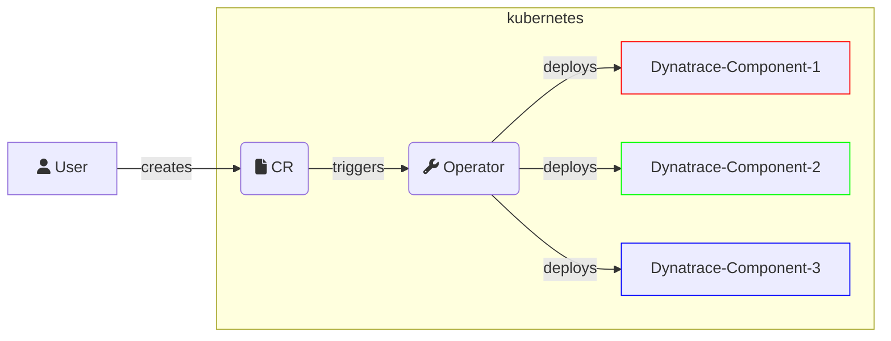

# Architecture

This document describes the high-level architecture of `Dynatrace Operator`.
If you want to familiarize yourself with the code base, you are just in the right place!

## Bird's Eye View

On a very high level, what the operator does is for a given `CustomResource`(CR) provided by the user, the `Operator` will deploy _one or several_ Dynatrace components into the Kubernetes Environment.

A bit more specifically:

- A `CustomResource`(CR) is configured by the user, where they provide what features or components they want to use, and provide some minimal configuration in the CR so the `Dynatrace Operator` knows what to deploy and how to configure it.
- The `Operator` not only deploys the different Dynatrace components, but also keeps them up to date.
  - The `CustomResource`(CR) defines a state, the `Dynatrace Operator` enforces it, makes it happen.

### Dynatrace Operator components

The `Dynatrace Operator` is not a single Pod, it consists of multiple components, encompassing several Kubernetes concepts.

#### Operator

This component/pod is the one that _reacts to_ the creation/update/delete of our`CustomResource(s)`, causing the `Operator` to _reconcile_.
A _reconcile_ just means that it will check what is in the `CustomResource(s)` and according to that creates/updates/deletes resources in the Kubernetes environment. (So the state of the Kubernetes Environment matches the state described in the `CR`)

Relevant links:

- [Operator Pattern](https://kubernetes.io/docs/concepts/extend-kubernetes/operator/)

#### Webhook

This component/pod is the one that _intercepts_ creation/update/delete of Kubernetes Resources (only those that are relevant), then either mutates or validates them.

- Validation: We only use it for our `CustomResource(s)`, it's meant to catch known misconfigurations. If the validation webhook detects a problem, the user is warned, the change is denied and rolled back, like nothing happened.
- Mutation: Used to modify Kubernetes Resources "in flight", so the Resource will be created/updated in the cluster like if it was applied with added modifications.
  - We have 2 use-cases for this:
    - Seamlessly modifying user resources with the necessary configuration needed for Dynatrace observability features to work.
    - Handle time/timing sensitive minor modifications (labeling, annotating) of user resources, which is meant to help the `Operator` perform more reliably and timely.

Relevant links:

- [What are webhooks?](https://kubernetes.io/docs/reference/access-authn-authz/extensible-admission-controllers/#what-are-admission-webhooks)

#### Init Container

Some configurations need to happen on the container filesystem level, like setting up a volume or creating/updating configuration files.
To achieve this we add our init-container (using the `Webhook`) to user Pods. As init-containers run before any other container, we can setup the environment of user containers to enable Dynatrace observability features.

Relevant links:

- [Init Containers](https://kubernetes.io/docs/concepts/workloads/pods/init-containers/)

#### CSI-Driver

A component that is present on all nodes, meant to provide volumes (based on the node's filesystem) to make the capabilities provided by the `Operator` to use less disk space and be more performant.

Relevant links:

- [CSI volume](https://kubernetes.io/docs/concepts/storage/volumes/#csi)

## Code Map

> TODO: Improve folder structure before documenting it more deeply, as its kind of a mess now. If I didn't mention it now, then I probably don't like its current location.

### `config`

Contains the `.yaml` files that are need to deploy the `Operator` and its components into a Kubernetes cluster. Also contains the helm chart with the respective values.yaml file where one can configure components of the `Operator`.

- most `.yaml` files are part of the Helm chart
- other `.yaml` files are relevant for different marketplaces

### `hack`

Collection of scripts used for:

- CI tasks
- Development (build,push,deploy,test, etc...)

### `hack/make`

Where the `make` targets are defined. We don't have a single makefile with all the targets as it would be quite large.

### `cmd`

Where the entry points for every `Operator` subcommand is found. The `Operator` is not a single container, but we still use the same image for all our containers, to simplify the caching for Kubernetes and mirroring of the `Operator` image in private registries. So each component has its own subcommand.

### `pkg/api`

Contains the `CustomResourceDefinitions`(CRDs) as Golang `structs` that the `Operator` reacts to. The `CustomResourceDefinition` yaml files are generated based on these `structs`.

### `pkg/controllers`

A Controller is a component that listens/reacts to some Kubernetes Resource. The `Operator` has several of these.

### `pkg/controllers/certificates`

The `Operator` creates and maintains certificates that are meant to be used by the webhooks. Certificates are required for a webhook to work in kubernetes, and hard coding certificates into the release of the `Operator` is not an option, the same is true for requiring the user to setup `cert-manager` to create/manage certs for the webhooks.

### `pkg/controllers/csi/driver`

Main logic for the CSI-Driver's `server` container. Implements the CSI gRPC interface, and handles each mount request.

### `pkg/controllers/csi/provisioner`

Main logic for the CSI-Driver's `provisioner` container. Handles the setting up the environment(filesystem) on the node, so the `server` container can complete its task quickly without making any external requests.

### `pkg/controllers/csi/gc`

Main logic for the CSI-Driver's garbage collector. Handles the unmounting and unpublishing of volumes that are not needed anymore or outdated. Basically removes files in the respective filesystem.

### `pkg/controllers/csi/metadata`

Main logic for the CSI-Driver's metadata. Handles the database with all necessary information that is needed for the CSI-Driver to be able to decide what should be done when.

### `pkg/controllers/dynakube` and `src/controllers/edgeconnect`

Main logic for the 2 `CustomResources`es the `Operator` currently has:

- `DynaKube`
- `EdgeConnect`

### `pkg/controllers/dynakube/activegate`

Main logic were the ActiveGate is handled within the `Dynakube` controller.

### `pkg/controllers/dynakube/activegate/capability`

Main logic for building, getting and other functionality for the capabilites than can be enabled in the `ActiveGate` section in the ``DynaKube``.

### `pkg/controllers/dynakube/activegate/consts`

Holds necessary constants that are used for the `ActiveGate`.

### `pkg/controllers/dynakube/activegate/internal`

Main logic for `ActiveGate` internal configuration.

### `pkg/controllers/dynakube/activegate/internal/authtoken`

Main logic for the authorization token that is needed for the `ActiveGate`.

### `pkg/controllers/dynakube/activegate/internal/capability`

Main logic for reconciling the `StatefulSet` and the `Service` that comes with the `ActiveGate` based on the capabilities that are passed in the `DynaKube`.

### `pkg/controllers/dynakube/activegate/internal/customproperties`

Main logic for creating and reconciling customproperties that are needed for the `ActiveGate`.

### `pkg/controllers/dynakube/activegate/internal/statefulset`

Main logic for the `StatefulSet` that comes with the `ActiveGate`. Building as well as reconciliation of said `StatefulSet` is done here.

### `pkg/controllers/dynakube/apimonitoring`

Main logic to create `Kubernetes` cluster settings, and reconciling them.

### `pkg/controllers/dynakube/connectioninfo/activegate`

Main logic for reconciling connection info for the `ActiveGate`. The secret is checked and also the communication hosts on the tenant.

### `pkg/controllers/dynakube/connectioninfo/oneagent`

Main logic for reconciling connection info for the `OneAgent`. The secret is checked and also the communication hosts on the tenant.

### `pkg/controllers/dynakube/deploymentmetadata`

Main logic of `Operator` related metadata. It reconciles necessary metadata for `OneAgent`, `ActiveGate` and so on. It also maintains a `ConfigMap` that holds metadata.

### `pkg/controllers/dynakube/dtpullsecret`

Main logic of pull secret for the `Operator`. It reconciles the secret and updates it if it is outdated.

### `pkg/controllers/dynakube/dynatraceapi`

Has information of what the status of the `Dynatrace` client is when it is making an API call.

### `pkg/controllers/dynakube/dynatraceclient`

Main logic of building the `Dynatrace` client. The client is then used to execute API calls.

### `pkg/controllers/dynakube/extension`

Has the configuration and reconciliation of extensions, that come into play if `Prometheus` is enabled. (Currently does nothing)

### `pkg/controllers/dynakube/injection`

Main logic of the injection functionality of the `Operator`. At first it reconciles `Codemodules`, communication endpoints and enrichment rules. After that it creates and sets up app injection, OneAgent injection and enrichment injection.

### `pkg/controllers/dynakube/istio`

Main logic of `Istio`. It reconciles `Istio` if it is enabled on the `DynaKube`. Creates `VirtualServices` and `ServiceEntries` that allow specified hosts to be excluded by `Istio`.

### `pkg/controllers/dynakube/metadata/rules`

Main logic of reconciling metadata enrichment rules. Checks if metadata enrichment is enabled in the `DynaKube` and queries the rules. Sets the rules in the `DynaKube` status.

### `pkg/controllers/dynakube/oneagent`

Main logic of the `OneAgent` reconciliation. Reconciles `OneAgent`, depending on the configuration in the DynaKube, creates, updates, removes corresponding `DaemonSet`.

### `pkg/controllers/dynakube/processmoduleconfigsecret`

Main logic of processmodule config secret. This secret has necessary data that is needed when it comes to injection. Reconciles the secret by creating it, updating and if needed deleting it.

### `pkg/controllers/dynakube/proxy`

Main logic of the proxy secret which is needed if proxy is enabled. Reconciles the secret and generates it if proxy is enabled for either `OneAgent` or `ActiveGate`.

### `pkg/controllers/dynakube/token`

Main logic of the API token that is needed for the `DynaKube`. Verifies scopes, adds features and also reads tokens.

### `pkg/controllers/dynakube/version`

Main logic of the version reconciler. Updates the image version status of the `DynaKube`. Deals with all types images:

- `ActiveGate`
- `CodeModules`
- `OneAgent`

### `pkg/controllers/edgeconnect/config`

Has the configuration that is needed for the `edgeConnect.yaml` that is generated by us and processed. Sets necessary fields.

### `pkg/controllers/edgeconnect/consts`

Has necessary constants that are used for `EdgeConnect`.

### `pkg/controllers/edgeconnect/deployment`

Main logic for creating the Deployment that comes with `EdgeConnect`.

### `pkg/controllers/edgeconnect/secret`

Main logic for creating the Deployment that is needed for `EdgeConnect`.

### `pkg/controllers/edgeconnect/version`

Main logic of the edgeconnect version updater. Updates the image version status of the `EdgeConnect`.

### `pkg/controllers/node`

The `Operator` keeps track of the nodes in the Kubernetes cluster, this is necessary to notice intentional node shutdowns so the `Operator` can notify the `Dynatrace Environment` about it. Otherwise the `Dynatrace Environment` would produce warnings when a node is shutdown even when it was intentional.

### `pkg/webhook/mutation`

Mutation webhooks meant for intercepting user Kubernetes Resources, so they can be updated in the instant the updates are required.

### `pkg/webhook/validation`

Validation webhooks meant for intercepting our `CustomResources` managed by the users, is they can be checked for well-know misconfigurations and warn the user if any problems are found.

### `pkg/injection/startup`

Main logic for the init-container injected by the `Operator`.

### `pkg/injection/codemodule`

Main logic for injection logic of the `CodeModule` image.

### `pkg/injection/codemodule/installer/common`

Has necessary constants that are used within this package.

### `pkg/injection/codemodule/installer/image`

Main logic of the agent installer. Pulls the OCI image, unpacks it and finally installs it.

### `pkg/injection/codemodule/installer/symlink`

Creates necessary symlinks for the image version if needed.

### `pkg/injection/codemodule/installer/url`

Main logic of the OneAgent package installer. Downloads the image from the url, unzips it and finally installs it.

### `pkg/injection/codemodule/installer/zip`

Main logic of the zip package installer of the agent image. Extracts the zip and places it in the right directory.

### `pkg/injection/codemodule/processmoduleconfig`

Main logic of the agent config directory. Creates said directory and places necessary config files there.

### `pkg/injection/namespace/ingestendpoint`

Main logic of the metadata enrichment endpoint secret that is created for certain `Namespaces` and `DynaKubes`. The secret is generated per `Namespace` or for every `Namespace` for a give `DynaKube`.

### `pkg/injection/namespace/initgeneration`

Main logic of the init secret that is created for certain `Namespaces` and `DynaKubes`. The secret is generated per `Namespace` or for every `Namespace` for a give `DynaKube`.

### `pkg/injection/namespace/mapper`

Main logic of mapping `Namespaces` and `DynaKubes`. Updates labels on both resources and checks if there are conflicting configurations.

### `pkg/injection/startup`

Main logic of the stand alone runner (`initContainer`) that will be injected into pods. Creates the runner, configures it properly and starts it.

### `pkg/lodg`

Main logic of the logger of the `Operator`. Is used all over the code base with a dedicated name to make logs more readable.

### `pkg/oci/dockerkeychain`

Main logic of configuration to be able to reach docker repositories.

### `pkg/injection/oci/registry`

Main logic that pulls images from docker registries.

### `pkg/util`

Utility packages that are used throughout the codebase. Packages contain Kubernetes resources as well as constants that are used frequently for example.

### `pkg/version`

Package that deals with semantic versions. Is able to extract said versions, compare them and so on.

### `pkg/webhook`

Main logic of the webhook. Both `MutationWebhook` as well as `ValidationWebhook` are handled here.

### `pkg/webhook/mutation/namespace`

Main logic of the `MutationWebhook` mutating `Namespaces`. Does the mapping between the `Namespaces` and `DynaKube` from the `Namespace's` side.

### `pkg/webhook/mutation/pod

Main logic of the `MutationWebhook` mutating `Pods`. Does the mapping between the `Namespaces` and `DynaKube` from the `Namespace's` side.

### `pkg/webhook/mutation/pod/metadata

Package that deals with necessary metadata for `Pods`. Sets up and prepares `Containers`, `Envs` and `Volumes` that are needed for mutating `Pods`.

### `pkg/webhook/mutation/pod/oneagent

Package that deals with necessary metadata for `OneAgent` related metadata. Sets up for example `Volumes` which hold necessary files that are needed for `OneAgent` installation.

### `pkg/webhook/util

Utils package that does operations like checking `EnvVars` in `Containers`.

### `pkg/webhook/validation

Main logic for the `ValidationWebhook`. Deals with both `DynaKube` and `EdgeConnect`. Checks if the configuration of said Resources is valid and can be applied. Gives warnings or even errors if there is some misconfiguration.

### `test`

E2E testing code. Unit tests are NOT found here, they are in the same module that they are testing, as that is the Golang convention.

### `test/features`

Respective feature for each scenario. Those features are then called within the tests and ran through.

### `test/helpers`

Package that has helpers which are needed for the E2E tests.

### `test/mocks`

Package that has mocks which are needed for the E2E tests.

### `test/project`

Package that sets up the root directory that will be used within the E2E tests.

### `test/scenarios`

Package that has all scenarios that are tested by the E2E tests. Those scenarios have a `Test*` function that calls the features from the `feature` package and runs the tests.

### `test/testdata`

Has every needed data that is needed to run the tests. This reaches from `Deployments` up to `Secrets` to install the `Operator`.
