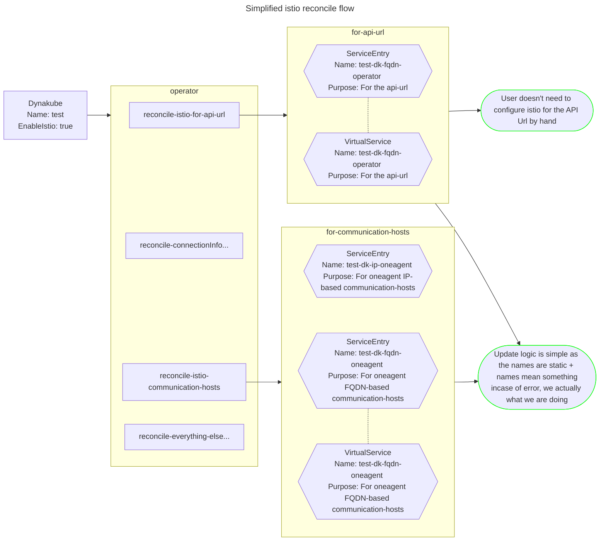

# How we handle the istio integration

For the `operator` and it's deployed components to work in an _istio environment_ in `REGISTRY_ONLY` mode it naturally needs a few `ServiceEntries` and `VirtualServices`.

We can differentiate between 2 "sources" of endpoints/hosts we have to worry about:

1. The `APIURL` defined in the `DynaKube`.
    - The operator uses to communicate with the Dynatrace Environment.
    - Should be handled before anything, otherwise the use would have to configure istio for this url.
2. The `Communication Hosts` of the `OneAgent`.
    - We get it from Dynatrace Environment periodically. (using the `APIURL`)
    - May dynamically change overtime, **main reason** for the integration. (otherwise there could be a "setup once" solution, no fancy operator required)

We can also differentiate between 2 "types" of endpoints/hosts, which is important because you can't mix them in a `ServiceEntry`, you have to create 1 for each type: (A `ServiceEntry` can have multiple hosts listed in it, but has to be the same "type")

1. IP based
    - Needs **no** corresponding `VirtualService`
2. FQDN(Fully qualified domain name) based
    - Needs corresponding `VirtualService`

